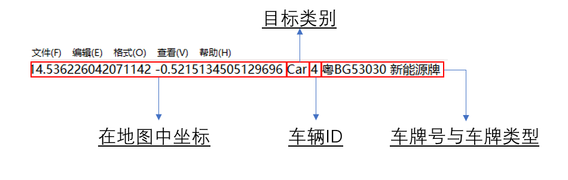

# 目标跟踪与车辆行为判断

## 复现步骤

### 环境安装

我们可以直接使用检测组YOLOv8的环境，如果你不想知道检测组干了些啥，你可以用下面的命令安装所需的依赖库：

```shell
pip install -r requirements.txt
```

我使用的python版本为3.9.18，版本不符合可能会造成不可预料的问题。


### 数据预处理

我们拿到的数据为每帧一个.txt文件（click [here](.\example_7_demo_0105\saved_points\world_coords_000.txt ))



我们将上面得到的数据进行处理，首先筛选出目标类别是Car的目标，然后筛掉车道之外的目标。我们为了兼容对YOLO输出的像素水平上的目标进行跟踪以及使用Opencv中的画图函数等，我们还将地图上的坐标转换成Opencv像素坐标系下的坐标，这一部分的程序在[changelabel.py](changelabel.py)中完成。

### example_7_demo_0105 

我们这个demo的主程序是[testborder.py](testborder.py)，直接点击运行即可。一个参考的输出（[here](video_out/exp2024-01-07_10-26-08.mp4)）。我们的参数可以在下图中的函数中调整，当然你也可以直接命令或者编辑器中更改，其中参数说明如下：


其中areas的形式是需要计数的矩形框的左上右下坐标，必须是坐标中左上、右下的形式否则一些判断函数会失效。

### 更多数据

你可以在下面的链接中得到我们更多的demo使用的数据，更改相应的路径即可。

数据链接：
链接：https://pan.baidu.com/s/1tSKmXOk_jpk7Gvc8n4N8Ag 
提取码：qjck 
